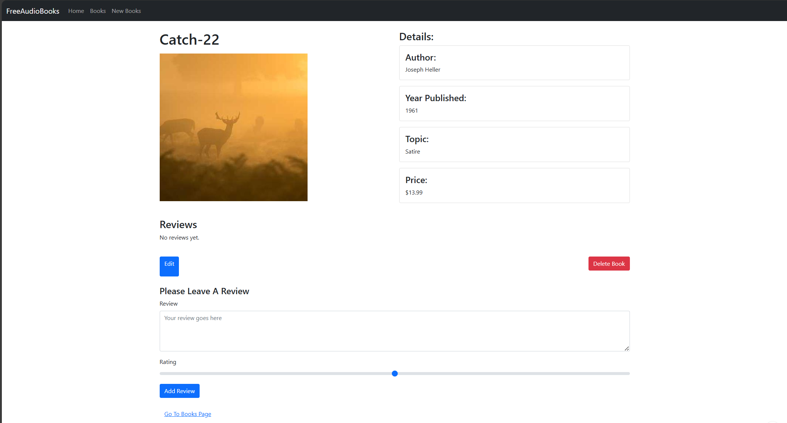

# FreeAudioBooks

FreeAudioBooks is a web development project aimed at creating a platform where users can upload books of their choice or access free books available online, converting them into AI-generated voice. This project allows users to listen to audiobooks at their convenience, offering a seamless learning experience on the go.

## Table of Contents
- [About the Project](#about-the-project)
- [Current Features](#current-features)
- [Future Plans](#future-plans)
- [Why FreeAudioBooks?](#why-freeaudiobooks)
- [Technologies Used](#technologies-used)

## About the Project

I created this repository to gain hands-on experience in web development while combining my interest in machine learning and AI. The vision behind FreeAudioBooks is to build a platform where users can upload and convert books into audiobooks using AI-generated voices, making knowledge more accessible and convenient for everyone.

Currently, the project includes basic CRUD functionality for books, with plans to expand and integrate AI-based voice conversion.

## Current Features Images

- **CRUD Operations**: Users can create, modify, and delete books. The books have a basic schema structure with fields such as:
  - **Title**
  - **Author**
  - **Name**
  - **Reviews**
- **Seeding Data**: The database is seeded with initial book data, which is rendered dynamically on the platform.

Note: At this stage, the books do not contain any PDF files; only the basic schema structure has been implemented.

## Current Features

### 1. Viewing All Books

### 2. Viewing a Specific Book

### 3. Creating a New Book

### 4. Editing an Existing Book

- **CRUD Operations**: Users can create, modify, and delete books. The books have a basic schema structure with fields such as:
  - **Title**
  - **Author**
  - **Name**
  - **Reviews**

## Future Plans

Although I am currently focusing on basic functionality, future development will include:
- **AI Integration**: Implement text-to-speech conversion using AI to generate audio versions of books.
- **Book Upload Functionality**: Enable users to upload books, including PDF files, and have them converted to audiobooks.
- **Free Book Access**: Integrate free books available online for users to convert into audiobooks.
- **Enhanced UI/UX**: Improve the design and usability of the platform for better user interaction.

## Why FreeAudioBooks?

FreeAudioBooks aims to make book consumption easier by allowing users to listen to audiobooks rather than reading. The platform is designed for flexibility and convenience, making it easier to absorb knowledge without needing to find time to read.

## Technologies Used

- **HTML/CSS/JavaScript**: For the frontend, enabling the dynamic rendering of book information.
- **Node.js/Express**: Backend for managing CRUD operations and serving book data.
- **MongoDB**: Database for storing book information (e.g., title, author, reviews).
- **Future**: AI models for text-to-speech conversion and file management.

---

This project is under active development, with new features and improvements coming soon. Stay tuned for updates!
